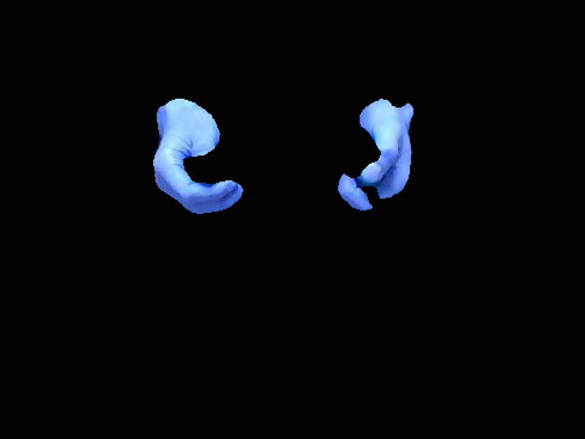
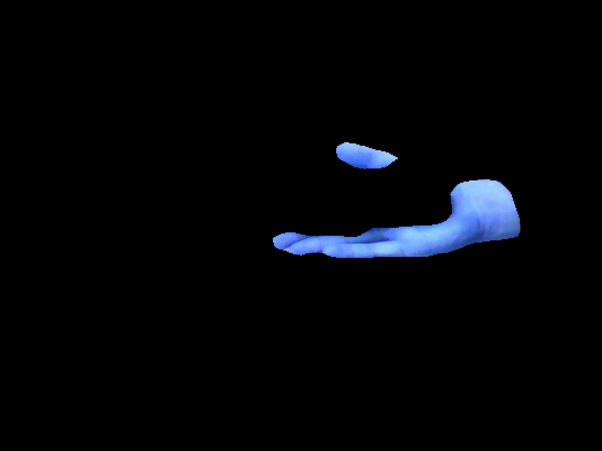

# ROS node for real-time (human) skin detection #

This is a ROS implementation of the [CSAILVision Semantic Segmentation/Scene Parsing framework (PSPNet)](https://github.com/CSAILVision/semantic-segmentation-pytorch) retrained on the egohands dataset. The NN is capable of detecting human skin with a mean intersection-over-union (IoU) score of 0.833.

This node is part of a larger project with the objective to enable object-independent human-to-robot handovers using robotic vision. The code for this project can be found [here](https://github.com/patrosAT/human_robot_handover_ros).

The node can be implemented as publisher, service, or action. See below for more inforamtion.

* **Input:** RGB image: [sensor_msgs/CompressedImage](http://docs.ros.org/melodic/api/sensor_msgs/html/msg/CompressedImage.html)
* **Output:** Mask (0 background, 1 human skin): [sensor_msgs/CompressedImage](http://docs.ros.org/melodic/api/sensor_msgs/html/msg/CompressedImage.html)

#### Example from a frontal perspective (full body): ####

#### Example from a lateral perspective (arm and hand only): ####

## Getting Started ##

The code have been tested with Python 3.6.

For using the pre-trained NN, the weights need to be downloaded from [Google Drive](https://drive.google.com/open?id=11kLgzLdFPy3yl03X6lBetebDpU5wLMQv) and placed in [/src/helper_CSAILVision/lib/segmentation/](/src/helper_CSAILVision/lib/segmentation/).

### Hardware ###

* RGB camera *(for this project an [realsense D435](https://www.intelrealsense.com/depth-camera-d435/) was used)*
* GPU >= 4 GB

### Software ###

**ATTENTION: This package requires the [ROS](https://www.ros.org/) operating system!**

* Python 2.x: see [requirements.txt](requirements.txt)
* Python 3.x: see [requirements3.txt](requirements3.txt)

### Launch ###

The ros package contains 3 launch files: publisher, service an action. 

* **[Publisher](launch/egohands_publisher.launch):** Publishes a mask every time a new image is published by the camera.
* **[Serivce](launch/egohands_service.launch):** Returns a mask upon service call.
* **[Action](launch/egohands_action.launch):** Returns a mask upon client call.

The input/output is identical for a all three nodes:
* **Input:** RGB image: [sensor_msgs/CompressedImage](http://docs.ros.org/melodic/api/sensor_msgs/html/msg/CompressedImage.html)
* **Output:** Mask (0 background, 1 skin): [sensor_msgs/CompressedImage](http://docs.ros.org/melodic/api/sensor_msgs/html/msg/CompressedImage.html)

## Configuration ##

The initial configuration can be changed by adapting the [bodyparts.yaml](cfg/bodyparts.yaml) file:

**Camera:** 
* **topic:** Rostopic the publisher is subscribing to. Altering this config has no impact on the service and action nodes.

**Interfaces:**
* **topic:** Rostopic the publisher node is publishing to.
* **service:** Rosservice for interacting with the service node.
* **action:** Rostopic for interacting with the action node.

**Visualization:** The visualization mode published a color-inverted copy (BGR) of the original RGB image with the background blacked out. Please be aware that turing on the visualization increases computing time and network utilization substantially.

* **topic:** Rostopic the node is publishing to.
* **activated:** Turn on/off visualization: *use only keywords **"True"** or **"False"***

## Acknowledgments ##

The ROS node is powered by the Pyramid Scene Parsing Network (PSPNet) of [CSAILVision](https://github.com/CSAILVision/semantic-segmentation-pytorch). The AI training with the egohands dataset was part of a [student's project](https://github.com/junwenkwan/hand-seg-tpv) at [University Monash](https://www.monash.edu/)

## License ##

This project is licensed under the 4-clause BSD License.

